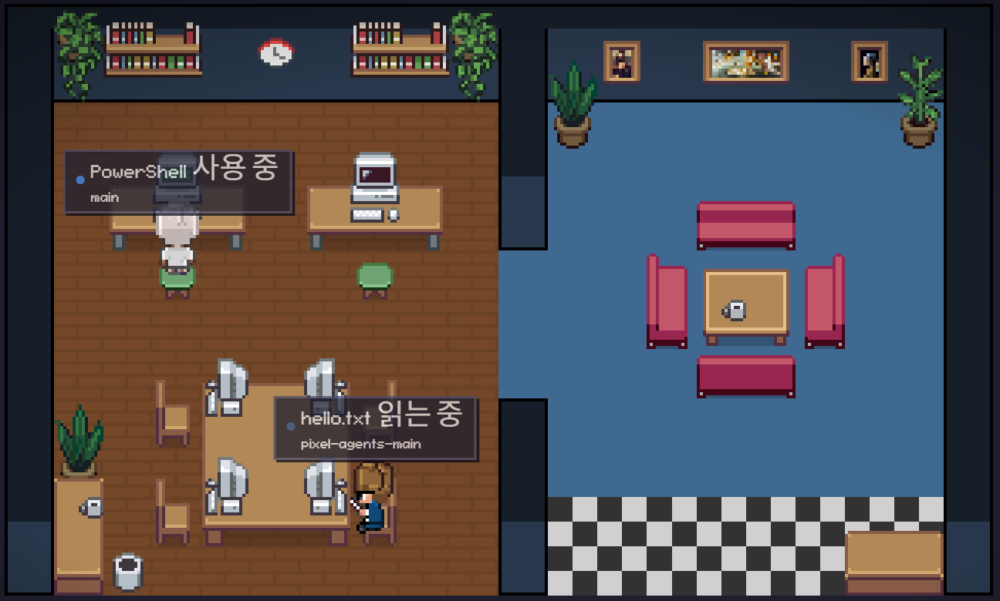

# pixel-agents-openrouter

OpenRouter의 여러 모델(GPT · Gemini · DeepSeek 등)을 각각 실제 도구를 쓰는 에이전트로 실행하고, 그 활동을 픽셀아트 사무실에 캐릭터로 실시간 시각화하는 프로젝트입니다.<br>각 캐릭터는 연결된 모델명을 달고, 모델이 실제로 호출한 도구에 따라 움직입니다.<br>상태 라벨은 한국어입니다.

바닐라 [Pixel Agents](https://github.com/pixel-agents-hq/pixel-agents)는 Claude Code 세션만 시각화하지만, 이 포크는 OpenRouter 멀티모델 시각화, 한국어화, 커스텀 캐릭터를 더했습니다.<br>그러면서 pixel-agents 코어/서버 소스는 한 줄도 수정하지 않았습니다.



*deepseek-chat-v3.1, gemini-2.5-flash, gpt-4o-mini 세 모델이 각각 캐릭터로 등장해, 자기 모델명을 달고 "실행 중 · 응답 생성 중" 라벨과 함께 동시에 작업 중입니다.*

## 바닐라와의 차이

| 구분 | 바닐라 Pixel Agents | 이 포크 |
|---|---|---|
| 시각화 대상 | Claude Code 세션만 | Claude + OpenRouter 임의 모델(GPT·Gemini·DeepSeek…) |
| 캐릭터 이름 | 작업 폴더명 | 연결된 모델명 |
| 활동 라벨 | 영어 (`Reading foo.ts`) | 한국어 (`foo.ts 읽는 중`) |
| 활동을 만드는 것 | Claude 훅이 자동 전송 | 브리지가 모델의 실제 tool 호출을 전송 |
| 캐릭터 그림 | 기본 6종 | 커스텀 교체본 |
| 코어/서버 수정 | — | 없음 |

## 핵심 아이디어

Pixel Agents는 **관찰형** 도구입니다. 스스로 LLM을 호출하지 않고, 에이전트가 보내는 이벤트를 받아 캐릭터로 그립니다. Claude Code는 훅(hooks) API가 내장돼 있어 실행되면 자동으로 규격에 맞는 이벤트를 서버로 보내지만, OpenRouter의 GPT·Gemini에는 그런 기능이 없습니다.

그런데 서버는 규격에 맞는 이벤트라면 누가 보냈는지 따지지 않습니다. 그래서 **모델을 실행하면서 그 활동을 이벤트로 대신 전송하는 브리지**(`openrouter-agents/run.mjs`)를 만들었습니다. 브리지가 원본의 이벤트 인그레스를 그대로 사용하므로, pixel-agents 코어는 수정할 필요가 없습니다.

## 동작 원리

```
┌────────────── openrouter-agents/run.mjs (브리지) ──────────────┐
│   .env 의 모델마다:                                            │
│     ┌──────────────┐  tools(function calling)  ┌────────────┐ │
│     │  에이전트 루프 │ ────────────────────────▶ │ OpenRouter │ │
│     │              │ ◀──────────────────────── │ chat/compl.│ │
│     └──────┬───────┘        tool_calls          └────────────┘ │
│            │  모델이 실제로 부른 도구를 이벤트로                 │
└────────────┼───────────────────────────────────────────────────┘
             │  POST /api/hooks/claude
             ▼
   ┌──────────────────┐  normalizeHookEvent  ┌────────────┐  broadcast  ┌───────────┐
   │ pixel-agents 서버 │ ───────────────────▶ │ AgentEvent │ ──────────▶ │ 픽셀 오피스 │
   │  (원본, 무수정)   │                      │  + 상태     │  WebSocket  │  (캔버스)  │
   └──────────────────┘                      └────────────┘             └───────────┘
     · 캐릭터 이름 = basename(cwd) = 모델명
     · 라벨 = formatToolStatus(tool) = 한국어
```

- **실제 tool-use로 구동** — 각 모델에게 실제 도구(`list_dir` · `read_file` · `write_file`, 샌드박스 한정)를 function calling으로 주고, 모델이 실제로 호출한 `tool_calls`를 그대로 캐릭터 활동으로 만듭니다. 미리 짠 순서를 재생하는 연출이 아니므로, 모델마다 도구 순서·횟수가 다르고 각 모델이 실제로 `summary.md`를 작성합니다.
- **모델명 표시** — 서버는 캐릭터 이름을 작업 폴더명(`basename(cwd)`)으로 정합니다. 각 모델이 자기 모델명 폴더(`workspace/<모델명>`)에서 작업하게 하면 그 폴더명이 곧 캐릭터 이름이 됩니다.
- **하트비트** — 합성 에이전트는 이벤트가 끊기면 서버가 세션 종료로 보고 캐릭터를 지웁니다. 그래서 작업 중 약 2초 간격으로 현재 활동을 재전송해 캐릭터를 유지합니다.

## 설치 및 실행

```bash
npm install
npm run build
node dist/cli.js --port 3100      # http://127.0.0.1:3100
```

브라우저에서 Settings → "Always Show Labels"를 켜면 한국어 라벨과 모델명이 항상 보입니다.

OpenRouter 모델을 띄우려면 프로젝트 루트에 `.env`를 만듭니다(키는 [openrouter.ai/keys](https://openrouter.ai/keys)):

```
OPENROUTER_API_KEY=sk-or-v1-...
OPENROUTER_MODELS=openai/gpt-4o-mini,google/gemini-2.5-flash,deepseek/deepseek-chat-v3.1
```

서버가 켜진 상태에서 브리지를 실행합니다:

```bash
node openrouter-agents/run.mjs
```

각 모델이 도구를 호출하며 오피스에 캐릭터로 등장합니다. 자세한 사용법은 [`openrouter-agents/README.md`](openrouter-agents/README.md) 참고.

## 변경한 파일

| 파일 | 내용 |
|---|---|
| `openrouter-agents/run.mjs` (신규) | OpenRouter 모델을 실제 tool-use 에이전트로 실행하고 활동을 이벤트로 전송하는 브리지. 외부 의존성 없음(Node 내장 fetch). |
| `.env.example` | `OPENROUTER_API_KEY`, `OPENROUTER_MODELS` 슬롯 추가. |
| `server/src/providers/hook/claude/claude.ts` | `formatToolStatus()` 표시 문구를 한국어로 교체(로직은 그대로). |
| `webview-ui/public/assets/characters/` | 캐릭터 스프라이트를 커스텀 교체본으로. |

## 커스텀 캐릭터 규격

| 항목 | 규격 |
|---|---|
| 파일 | `char_0.png` ~ `char_5.png` (6개) |
| 크기 | 112 × 96 픽셀 |
| 배치 | 가로 7프레임(16px) × 세로 3방향(32px). 행0=정면, 행1=뒤, 행2=오른쪽(왼쪽은 자동 반전) |
| 프레임 순서 | 걷기1·걷기2·걷기3 · 타이핑1·타이핑2 · 읽기1·읽기2 |
| 필수 | 배경 투명, 21칸 발 높이 동일 |
| 위치 | `webview-ui/public/assets/characters/` |

## 더 읽기

- [초보자용 강의노트](docs/lecture-note.html) — 무엇을 바꿔서 무엇이 달라졌는지 단계별 설명
- 원본 아키텍처: [`CLAUDE.md`](CLAUDE.md)

## 라이선스

MIT — 원저작물 [Pixel Agents](https://github.com/pixel-agents-hq/pixel-agents). 캐릭터 스프라이트는 직접 제작/교체본입니다.